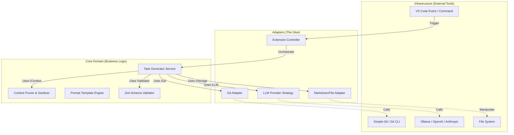

This is a strong starting point, but we can significantly mature the architecture by applying **SOLID principles** (specifically Dependency Inversion and Open/Closed) and **Clean Architecture** patterns. This ensures the extension is testable, agnostic to the specific LLM provider, and easy to maintain as VS Code APIs evolve.

Here are the specific improvements, followed by the fully updated plan.

### Part 1: Strategic Improvements & SOLID Principles

#### 1. Apply Dependency Inversion (DIP) & Hexagonal Architecture

**The Problem:** Your previous plan had the `Event Listener` directly calling the `Git Analyzer`. If you switch from `simple-git` to VS Code’s native `git.d.ts` API, you break the chain.
**The Fix:** Define **Ports (Interfaces)** for your core logic to interact with.

* **GitPort:** Interface for fetching diffs.
* **LLMPort:** Interface for generating text.
* **FileSystemPort:** Interface for reading/writing Markdown.
* *Benefit:* You can swap "Ollama" for "OpenAI" or "VS Code Git" for "CLI Git" without touching the core business logic.

#### 2. Apply Open/Closed Principle (OCP) via Strategy Pattern

**The Problem:** The `LLM Interface Layer` suggests handling generic "Providers."
**The Fix:** Implement a **Strategy Pattern**. The core logic asks for an `LLMStrategy`. You create concrete classes (`OllamaStrategy`, `AnthropicStrategy`, `OpenAIStrategy`). To add a new provider in 2027, you create a new class; you don't modify the existing code.

#### 3. Enhanced Security & Privacy (The "Context Window" Problem)

**The Problem:** Sending `package-lock.json` or `.env` files to an LLM by accident.
**The Fix:** Implement a **Context Pruning Service** (RAG-lite).

* Use `.gitignore` logic *plus* a custom `.llmignore`.
* **Token Budgeting:** Before sending to LLM, calculate token count. If > Context Window, prioritize: `Commit Messages > Staged Code > Unstaged Code`.

#### 4. Structured Output Validation (Robustness)

**The Problem:** LLMs hallucinate JSON formats (e.g., missing commas).
**The Fix:** Use **Zod** for runtime schema validation. If the LLM returns bad JSON, the Zod parser fails, triggers a "Repair Prompt" (sending the error back to the LLM to fix), or falls back gracefully.

---

### Part 2: Updated Architecture Diagram (Clean Architecture)

This diagram separates the **Core Domain** (Business Logic) from the **Infrastructure** (Tools).



---

### Part 3: Fully Updated Development Plan

**Tech Stack:** TypeScript, VS Code API, Zod (Validation), Handlebars (Templating), Remark (Markdown AST), InversifyJS (Optional, for Dependency Injection).

#### Phase 1: Core Domain & Abstractions (Week 1)

*Focus: Define the "What", ignore the "How".*

1. **Scaffold**: Use `yo code` + TypeScript + ESLint + Prettier.
2. **Define Interfaces (The Contract)**:
* `IGitService`: methods `getDiff()`, `getCurrentBranch()`.
* `ILLMProvider`: method `generate(prompt: string): Promise<string>`.
* `ITaskParser`: method `parse(rawOutput: string): JiraTask`.


3. **Implement Domain Logic**:
* Create `ContextPruner`: Logic to strip comments, imports, or lock files from strings to save tokens.
* Create `PromptBuilder`: A class that takes variables and fills Handlebars templates.


4. **Test**: Write Unit Tests for the `ContextPruner` and `PromptBuilder` using mock data. No real Git/LLM calls yet.

#### Phase 2: Infrastructure Adapters (Week 2)

*Focus: Connecting to the real world.*

1. **Git Adapter**: Implement `IGitService` using `simple-git`. Add safeguards to ignore binary files.
2. **LLM Strategies (The Brain)**:
* Create `OllamaStrategy`: Connects to `localhost:11434`.
* Create `OpenAIStrategy`: Connects to API.
* *Best Practice:* Implement a "Connection Tester" button in settings to verify the user's API key/URL works.


3. **Output Parsing**:
* Implement `Zod` schemas for the expected Jira Ticket JSON.
* Implement a "JSON Extractor" that finds the JSON block inside the LLM's Markdown response (LLMs love to add conversational filler like "Here is your JSON...").


#### Phase 3: The Glue & VS Code UI (Week 3)

*Focus: Tying it together for the user.*

1. **Extension Controller**:
* Map the `extension.generateJira` command.
* Instantiate the specific adapters based on `vscode.workspace.getConfiguration()`.


2. **UI Feedback**:
* Use `vscode.window.withProgress` to show a spinner ("Reading Git...", "Consulting LLM...", "Parsing...").
* *Better Practice:* Don't auto-write to the file. Open a **Webview** or a **Virtual Document** showing the preview of the generated Jira ticket side-by-side with the diff.


3. **Markdown AST**:
* Use `unified` and `remark` to parse the existing `tickets.md`.
* Implement an "Upsert" logic: If Ticket ID exists, replace the section; otherwise, append to the "To Do" list.


#### Phase 4: Refinement & Robustness (Week 4)

*Focus: Handling 2026-era edge cases.*

1. **Token Management**: Implement a "Sliding Window" or "Summary" fallback. If the diff is > 30k tokens, prompt the LLM to "Summarize changes" first, then use the summary to generate the ticket.
2. **Secret Sanitization**:
* Regex scan for `sk-proj-...`, AWS keys, or generic high-entropy strings before sending to LLM. Replace with `<REDACTED>`.


3. **Telemetry (Privacy-First)**: Log *success/fail* rates and *latency*, but never log the code diffs or prompt content.
4. **Configuration**: Add VS Code settings for:
* `jiraGenerator.promptLanguage` (English, Spanish, etc.).
* `jiraGenerator.customInstructions` (e.g., "Always add a 'Regression Risk' section").


---

### Key Code Example: Dependency Inversion

Instead of hardcoding the LLM, use this pattern in your main controller:

```typescript
// 1. The Interface
interface ILLMStrategy {
    complete(prompt: string): Promise<string>;
}

// 2. Concrete Implementation (Ollama)
class OllamaStrategy implements ILLMStrategy {
    constructor(private baseUrl: string, private model: string) {}
    async complete(prompt: string): Promise<string> {
        // fetch call to localhost...
        return response.json();
    }
}

// 3. The Factory (Decides which one to use based on settings)
class LLMFactory {
    static getStrategy(config: vscode.WorkspaceConfiguration): ILLMStrategy {
        if (config.get('provider') === 'openai') {
            return new OpenAIStrategy(config.get('apiKey'));
        }
        return new OllamaStrategy(config.get('localUrl'), config.get('model'));
    }
}

// 4. Usage in Command
const strategy = LLMFactory.getStrategy(vscode.workspace.getConfiguration('jiraGen'));
const result = await strategy.complete(diffData);

```

### Next Step 
**Should** use Bun for this project, but with a critical distinction: **Use Bun as your build tool and developer environment, NOT as the runtime for the shipped extension.**

VS Code extensions run inside the VS Code host (which is Node.js/Electron). Users will not have Bun installed, so you cannot use `Bun.serve`, `Bun.file`, or `Bun.sqlite` in the code you ship.

However, Bun is arguably the **best choice in 2026** for building, testing, and managing the project.

Here is the updated strategy integrating Bun into your **Clean Architecture** plan.

### 1. The "Bun Strategy": Dev Tool vs. Runtime

| Feature | Can I use it? | Context |
| --- | --- | --- |
| **`bun install`** | **YES** | Use it to manage packages. It's faster and creates a `bun.lockb`. |
| **`bun run`** | **YES** | Use it for scripts. Replace `npm run build` with `bun run build`. |
| **`bun test`** | **YES** | Use it for **Unit Tests** (your Core Domain logic). It's 10x faster than Jest. |
| **`Bun.build`** | **YES** | Use it to bundle your extension. It replaces Webpack/Esbuild. |
| **`Bun.file()`** | **NO** 🛑 | In `extension.ts`, you must use `vscode.workspace.fs` or Node's `fs`. |
| **`Bun.serve()`** | **NO** 🛑 | In `extension.ts`, you cannot start a server this way. |
| **`Bun.$`** | **YES** | Use it in your *build scripts* (e.g., to zip the extension or tag git releases). |

---

### 2. Updated Phase 1: Setup with Bun

Using Bun simplifies your `package.json` and removes the need for complex Webpack configs.

**Step 1: Initialize**

```bash
mkdir jira-auto-gen
cd jira-auto-gen
bun init
bun add -d vscode @types/vscode @types/node rimraf
bun add simple-git zod handlebars remark unified

```

**Step 2: The Builder (Replacing Webpack)**
Create a file `build.ts`. This uses Bun's internal bundler to compile your TypeScript for VS Code (Node environment).

```typescript
// build.ts
import { build } from "bun";

// Clean output dir
// (You might use 'rimraf' or Bun.$`rm -rf out`)

await build({
  entrypoints: ["./src/extension.ts"],
  outdir: "./out",
  target: "node",      // CRITICAL: Builds for Node (VS Code's runtime), not Bun
  external: ["vscode"], // CRITICAL: VS Code provides this at runtime
  minify: true,         // Best practice for extensions
  sourcemap: "external", // Good for debugging
});

console.log("✅ Extension built successfully via Bun!");

```

**Step 3: The `package.json` Scripts**
Update your scripts to leverage Bun.

```json
{
  "scripts": {
    "vscode:prepublish": "bun run build.ts",
    "compile": "bun run build.ts",
    "watch": "bun run build.ts --watch", 
    "test:unit": "bun test",
    "test:e2e": "node ./test/runTest.js" 
  }
}

```

*Note: `test:e2e` still uses Node because it launches the actual VS Code application instance.*

---

### 3. Updated Testing Strategy with Bun

This is where your **SOLID** architecture pays off. You can split your tests:

* **Fast Unit Tests (`bun test`):**
Test your **Core Domain** (Prompt Engineering, Zod Validation, Markdown Parsing). These tests will run instantly.
```typescript
// src/domain/promptBuilder.test.ts
import { describe, expect, test } from "bun:test";
import { buildPrompt } from "./promptBuilder";

test("generates correct prompt structure", () => {
  const result = buildPrompt({ diff: "..." });
  expect(result).toContain("Generate Jira Task");
});

```


* **Slow Integration Tests (VS Code Test Runner):**
Test the **Extension Activation** and **Command Registration**. These must run inside VS Code (Node).

---

### 4. Revised "Best Practice" Plan (Bun Edition)

**Phase 1: Setup & Core Logic (Bun Powered)**

* Initialize with Bun.
* Set up `bun test` for your Logic Layer (`ContextPruner`, `PromptBuilder`).
* **Benefit:** Zero config testing; no Jest/Mocha setup required.

**Phase 2: Adapters & Build**

* Write `build.ts` using `Bun.build` API.
* **Benefit:** Builds are milliseconds instead of seconds. No Webpack boilerplate.

**Phase 3: VS Code Integration**

* Use `vscode` namespace APIs (Standard Node.js).
* **Constraint:** Remember to check `process.versions` if you are debugging, to remind yourself you are in Node, not Bun.

**Phase 4: CI/CD**

* Use `oven-sh/setup-bun` in GitHub Actions.
* Run `bun install` and `bun test` in your pipeline (much faster/cheaper CI minutes).

## Best practices to care about
Here are the practices that matter most when your VS Code extension (TypeScript) does **(a)** LLM calls and **(b)** database/storage work.

## 1) Keep the extension fast and “lazy”

* **Use tight activation events** (usually `onCommand`, `onLanguage`, etc.) so your extension doesn’t slow startup. Avoid activating on `*` unless you truly need it. ([Visual Studio Code][1])
* **Do as little as possible in `activate()`**: register commands/providers, then lazy-init your LLM client / DB on first use.
* For long work, use **`vscode.window.withProgress` + cancellation** so users can stop the request. ([GitHub][2])
* If you have CPU-heavy logic (indexing, parsing, embeddings at scale), consider **moving it out of the extension host** (e.g., Language Server / separate process) for stability and performance. ([Visual Studio Code][3])

## 2) Prefer VS Code’s built-in AI APIs when it fits

If your “LLM call” is meant to integrate with VS Code’s chat/agent experience, strongly consider:

* **Language Model API** for sending requests to the user-selected model, with guidance on **model availability** and **rate limiting** (and VS Code being transparent about extension LM usage/quotas). ([Visual Studio Code][4])
* **Chat Participant API** if you want an `@yourExtension` assistant inside VS Code chat. ([Visual Studio Code][5])
* **Tool API** if your LLM triggers actions (reading files, querying DB, modifying workspace): it explicitly supports **tool confirmations** so the user understands what will happen. ([Visual Studio Code][6])

This route can also reduce how many users you force to manage API keys, and it lines up with VS Code’s publishing guidance for AI extensions. ([Visual Studio Code][4])

## 3) If you *do* call an external LLM API

* **Store API keys in `SecretStorage`** (encrypted; not synced across machines). Don’t put secrets in `settings.json`, `globalState`, or plaintext files. ([Visual Studio Code][7])
* **Respect enterprise networking** (proxies, authenticated proxies). Ideally: document that your extension honors VS Code’s proxy configuration and behaves well behind it. ([Visual Studio Code][8])
* Add guardrails to avoid accidental data leakage:

  * Make it explicit what content is sent (current selection / current file / whole workspace).
  * Provide a “redaction” layer (remove tokens, passwords, `.env` patterns) before sending.
  * Don’t automatically upload lots of workspace content without a clear user action.
* Design for **rate limits + retries**: backoff, request coalescing (“dedupe” identical prompts), caching, and cancellation.
* Testing: unit-test prompt building + response parsing, but **don’t rely on live model calls in integration tests** (nondeterminism + rate limiting). ([Visual Studio Code][4])

## 4) Database/storage: where + how

* Use the right storage primitive:

  * **Small key/value state** → `context.workspaceState` / `context.globalState`.
  * **Real DB files / large data** → `context.storageUri` (per-workspace) or `context.globalStorageUri` (across workspaces). ([Visual Studio Code][7])
  * VS Code will even warn on “large extension state” and suggest moving data to `storageUri/globalStorageUri`. ([GitHub][9])
* **Open DB lazily** and keep writes async/batched (especially if you update on events like `onDidChangeTextDocument`).
* **Plan migrations**: version your schema; run migrations once per workspace; be robust if a migration fails mid-way.
* Prefer **append-only logs + periodic compaction** for large telemetry-like datasets.

### Native modules warning (SQLite, etc.)

Many popular SQLite libs use native addons. That can work, but it comes with packaging/support cost:

* Native modules often need to be rebuilt against **the Node/Electron version embedded in VS Code**. ([GitHub][10])
  If you want fewer “it breaks on platform X / VS Code update Y” issues, consider a pure-JS/WASM option, or isolate native pieces behind a clear adapter so you can swap implementations.

## 5) Web vs Desktop: decide early

If you intend to support **VS Code for the Web**, be aware the web extension host has limitations (no Node runtime, restricted module loading), which can directly impact DB choices and some networking approaches. ([Visual Studio Code][11])

## 6) Security, trust, and UI surfaces

* **Workspace Trust**: if your extension reads/executed content from the workspace (or sends it to an LLM), make trust-sensitive features degrade in Restricted Mode and explain why. ([Visual Studio Code][12])
* **Webviews** (if you use them): lock them down with a **Content Security Policy**, sanitize untrusted input, and avoid loading arbitrary remote scripts. ([Visual Studio Code][13])
* Understand VS Code’s extension security posture (it matters for user confidence and enterprise rollout). ([Visual Studio Code][14])

## 7) Build, test, ship like a “real product”

* **Bundle your extension** (esbuild/webpack/rollup) to reduce files and improve load performance. ([Visual Studio Code][15])
* Use official guidance for **testing**, **CI**, and **publishing**:

  * Integration tests with `@vscode/test-electron` + recommended launch args (e.g., `--disable-extensions`). ([Visual Studio Code][16])
  * Package/publish with `vsce` (and keep a tight `.vscodeignore`). ([Visual Studio Code][17])
* Track VS Code runtime changes: e.g., the **Node.js extension host moved to v22** (from v20) as part of an Electron update—this can affect dependencies and polyfills. ([Visual Studio Code][18])

---
[1]: https://code.visualstudio.com/api/references/activation-events?utm_source=chatgpt.com "Activation Events | Visual Studio Code Extension API"
[2]: https://github.com/microsoft/vscode-extension-samples/blob/main/progress-sample/README.md?utm_source=chatgpt.com "vscode-extension-samples/progress-sample/README.md at main - GitHub"
[3]: https://code.visualstudio.com/api/language-extensions/language-server-extension-guide?utm_source=chatgpt.com "Language Server Extension Guide - Visual Studio Code"
[4]: https://code.visualstudio.com/api/extension-guides/ai/language-model "Language Model API | Visual Studio Code Extension
API"
[5]: https://code.visualstudio.com/api/extension-guides/ai/chat "Chat Participant API | Visual Studio Code Extension
API"
[6]: https://code.visualstudio.com/api/extension-guides/ai/tools "Language Model Tool API | Visual Studio Code Extension
API"
[7]: https://code.visualstudio.com/api/extension-capabilities/common-capabilities?utm_source=chatgpt.com "Common Capabilities | Visual Studio Code Extension API"
[8]: https://code.visualstudio.com/docs/setup/network?utm_source=chatgpt.com "Network Connections in Visual Studio Code"
[9]: https://github.com/microsoft/vscode/issues/255113?utm_source=chatgpt.com "Terminal suggest: Move on to storage URI #255113 - GitHub"
[10]: https://github.com/microsoft/vscode-discussions/discussions/768?utm_source=chatgpt.com "Correct way to publish extensions with native modules? - GitHub"
[11]: https://code.visualstudio.com/api/extension-guides/web-extensions?utm_source=chatgpt.com "Web Extensions | Visual Studio Code Extension API"
[12]: https://code.visualstudio.com/api/extension-guides/workspace-trust?utm_source=chatgpt.com "Workspace Trust Extension Guide - Visual Studio Code"
[13]: https://code.visualstudio.com/api/extension-guides/webview?utm_source=chatgpt.com "Webview API | Visual Studio Code Extension API"
[14]: https://code.visualstudio.com/docs/configure/extensions/extension-runtime-security?utm_source=chatgpt.com "Extension runtime security - Visual Studio Code"
[15]: https://code.visualstudio.com/api/working-with-extensions/bundling-extension?utm_source=chatgpt.com "Bundling Extensions | Visual Studio Code Extension API"
[16]: https://code.visualstudio.com/api/working-with-extensions/testing-extension?utm_source=chatgpt.com "Testing Extensions | Visual Studio Code Extension API"
[17]: https://code.visualstudio.com/api/working-with-extensions/publishing-extension?utm_source=chatgpt.com "Publishing Extensions | Visual Studio Code Extension API"
[18]: https://code.visualstudio.com/updates/v1_101?utm_source=chatgpt.com "May 2025 (version 1.101) - Visual Studio Code"
